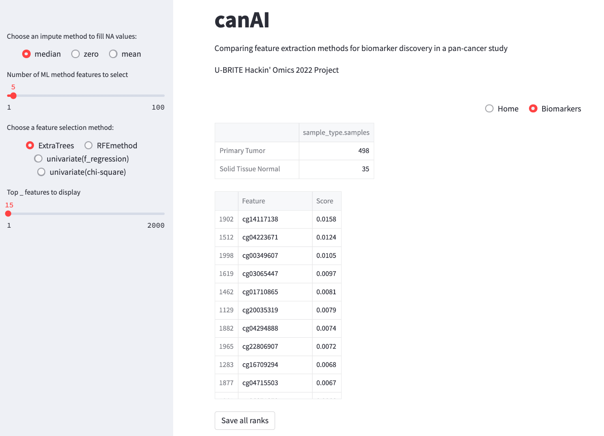

# canAI

*Aim:* Comparing feature extraction methods for biomarker discovery in a prostate-cancer study.

## Table of Contents

- [canAI](#canai)
    - [Background](#background)
    - [Data](#data)
    - [Usage](#usage)
        - [Installation](#installation)
        - [Requirements](#requirements)
        - [Activate pip environment](#activate-conda-environment)
        - [Steps to run ](#steps-to-run)
            - [Run Streamlit App](#run-streamlit-app)
    - [Results](#results)
    - [Team Members](#team-members)
    - [References](#references)

## Background

The availability of large -omics data sets holds promise for identifying biomarkers that can impact cancer diagnosis,
risk stratification, and treatment as well as an understanding of disease pathophysiology. Given the large, high
dimensional data sets generated by these methods, machine learning tools hold promise to help extract features and
integrate -omic data sets so that useful biomarkers can be identified.  Prostate cancer is the second most common cancer
in the US with an estimated 34,500 deaths in 2022. In this study we will use transcriptome and methylation data from
TCGA and integrate it with phenotypic data using a set of machine learning models.  We will then use this integrated
data to look for biomarkers which correlate with outcome measures such as disease recurrence, metastasis, and rise in
PSA level. A web facing app to visualize the data will be developed to allow exploration of the data by clinicians and
researchers without extensive data science training.

## Workflow


## Data

The Cancer Genome Atlas (TCGA) is one repository of cancer data
which is available and has both clinical (phenotypic) data and genomic, epigenetic, and transcriptomic data on prostate
cancer.

## Usage

canAI can be accessed as a streamlit site to look at features resulting from Tumor vs Normal samples.

### Installation

Installation simply requires fetching the source code. Following are required:

- Git

To fetch source code, change in to directory of your choice and run:

```sh
git clone -b main \
    https://github.com/u-brite/canAI.git
```

### Requirements

*OS:*

Currently works only in Mac OS. Docker versions may need to be explored later to make it useable in Mac (and
potentially Windows).

*Tools:*

- Pip3
- Streamlit
- Scikit-learn
- Plotly

### Activate pip environment

Change in to root directory and run the commands below:

```sh
# create pip environment. Needed only the first time.
python3 -m venv canAI

# activate pip environment
source canAI_venv/bin/activate

# Install packages in the environment
pip install -r requirements.txt
```

### Steps to run

#### Run Streamlit App

```sh
streamlit run src/streamlit_app.py
```

## Results

Survival analysis plots show the occurence of death over time. The survival function is the probability that the death
has not occured yet. For the analysis we used the KaplanMeierFitter class from the lifelines python module[2]. It has
been fitted on the days_to_death and days_to_first_biochemical_recurrence columns from the dataset.


We hypothesis that Machine Learning feature selection methods would be able to find novel biomarkers that distinguish
prostate cancer patients than traditional Differential Expression analysis. We chose 4 methods from scikit-learn
package:

* ExtraTrees - Results [here](results/feature_importance_readme.md)

* RFEmethod - Results [here](results/rfe_readme.md)

* Univariate (f_regression) - Results [here](results/univariateFregress.md)

* Univariate (chi-square) - Resulting network [here](results/STRING-Chi2-PC-pathway-genes.svg)

#### Streamlit App



## Team Members


|Name | Email | Role |
----|--|--|
|Tarun Mamidi               | tmamidi@uab.edu                   | Team Leader |
|Jędrzej Kubica             |	jj.kubica@student.uw.edu.pl     | Team Member |
|Mohit Bansal               |	mbansal@uabmc.edu               | Team Member |
|Sarmad Mehmood             |	smehmood@uab.edu                | Team Member |
|Santhosh Kumar Karthikeyan | skk0811@uab.edu                   | Team Member |
|Shannon Lynch              |	slynch97@uab.edu                | Team Member |
|Sylvia Robertson           |	sylrober@iupui.edu              | Team Member |
|Kevin Buckley              |	kevin.buckley@atriumhealth.org  | Team Member |

## References:
1. https://plotly.com/python/v3/ipython-notebooks/survival-analysis-r-vs-python/

2. https://lifelines.readthedocs.io/en/latest/

3. https://www.frontiersin.org/articles/10.3389/fgene.2021.620453/full

4. https://www.biorxiv.org/content/10.1101/2021.09.29.462364v1.full.pdf
